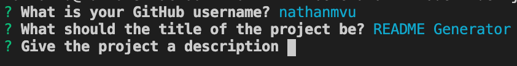
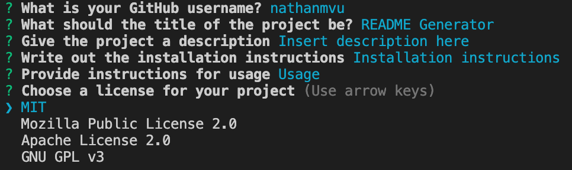
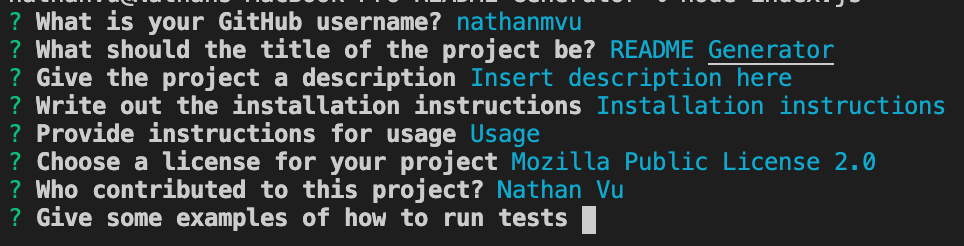

# README Generator

## Description
This is a program which will help generate a well detailed README.md for your project or at least create a skeleton upon which the user can add more detail to later on. The generated README.md will include: title, description, table of contents, installation, usage, license, contributions, tests, and questions. Currently there are only 4 options for licenses.

## Table of Contents
* [Installation](#installation)
* [Usage](#usage)
* [License](#license)
* [Contributing](#contributing)
* [Tests](#tests)

## Installation
To run the program you will need to install:
* Node.js
* npm (Run npm install in integrated terminal)

## Usage
[Deployed Link](https://nathanmvu.github.io/README-Generator/)
To use program, first install it from the Github repository. Once installed open an integrated terminal for the index.js file and run an npm install. Finally run "node index.js" in the integrated terminal and the program will begin prompting you for information on your README. If you input blank on a question then the section of the README will me skipped.

## Screenshots
* First prompt:

* Second prompt:

* Third prompt:

## License

## Contributing
Nathan Vu
* [Github](https://github.com/nathanmvu/)
* [LinkedIn](https://www.linkedin.com/in/nathan-vu/) 

## Tests
To test the application, you can input gibberish to answer each prompt and it should still fill out the frame of the README for you to fill with details later on.

## Questions
Direct to:
* [Github](https://github.com/nathanmvu/)
* [Email](mailto:nathanvu99@gmail.com)